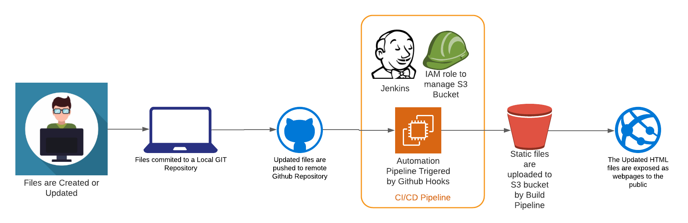
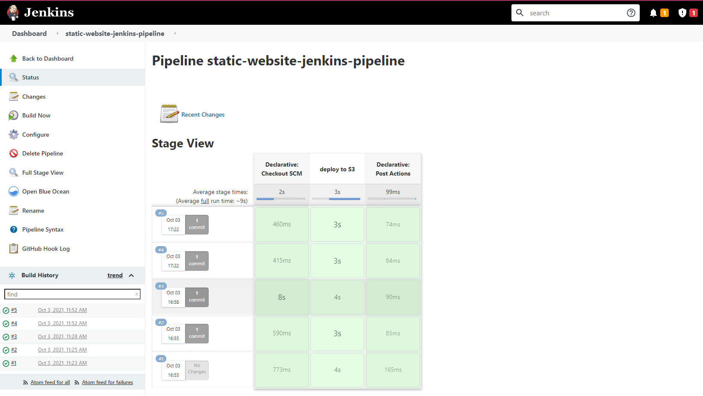

# Deploy a Static Website on S3 using Jenkins Pipeline

## Build an automated pipeline on Jenkins to upload the static files to a S3 bucket.

#### The static Website files are pushed into a GIT repository, this Repository serves as a version control for our website.
#### Once the files are updated, they are commited to the local repository.
#### Now these files are pushed to a GitHub Repository, Other developers can collaborate to work on the same files in this repository.
#### Once the files are pushed to GitHub, it triggers a pre-configured webhook to trigger a release pipeline.
#### This pipeline uploads the files to the S3 bucket on AWS. A seperate IAM credential is used by the pipeline to authenticate and upload the files to S3.
#### Any new change to the files will trigger the same workflow, as the new/updated files are pushed to remote GitHub Repository they are automatically deployed to S3.
